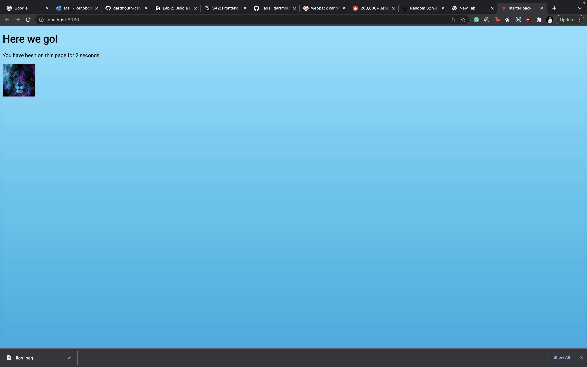

# Short Assignment 2
## Rehoboth Okorie

*description*

[deployed url](https://rehoboth-sa2.netlify.app/)

## What Worked Well
- The scripting
- Babel integration
- Eslint
- CSS/SCSS Loaders

## What Didn't
- I had a bit of an issue with webpack at first. It did not work until I integrated html.

## 1. Checklist: 
- webpack dev server starts and serves pages
- babel is configured
- eslint is configured - it complains if there is bad code / autocorrects indents etc
- webpage displays and counts seconds
- image displays and is loaded via webpack
- js is es6 and linted without errors!

## Extra Credit

## Screenshots

